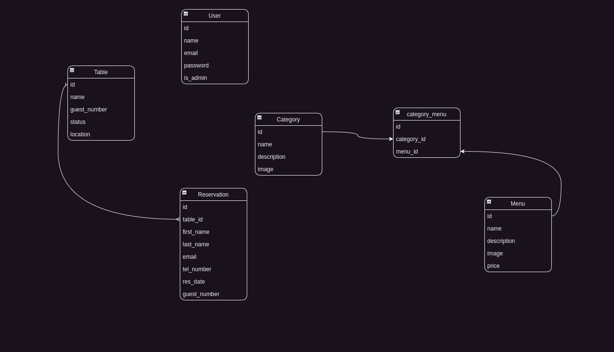

<p align="center"><a href="https://laravel.com" target="_blank"></a></p>


## About the Project

This project for learning laravel framework and this is project writing with video lesson of Nuraliyev

## Guide of Install Porject


``` 
cp .env.example .env
```
``` 
composer install 
```
``` 
npm install 
```
``` 
php artisan key:generate
```
``` 
php artisan migrate:fresh -seed
```
``` 
php artisan sortage:link
```
``` 
npm run dev
```

## Admin
- admin email: admin@gmail.com
- passowrd: password

## Structure of Database


## Contributing
You may to contribute this project [Samandar Abdullayev](https://github.com/xkas01/laravel_restaurant) apply this url.

## .env
- DB_HOST = mysql
- MAIL_MAILER = log
